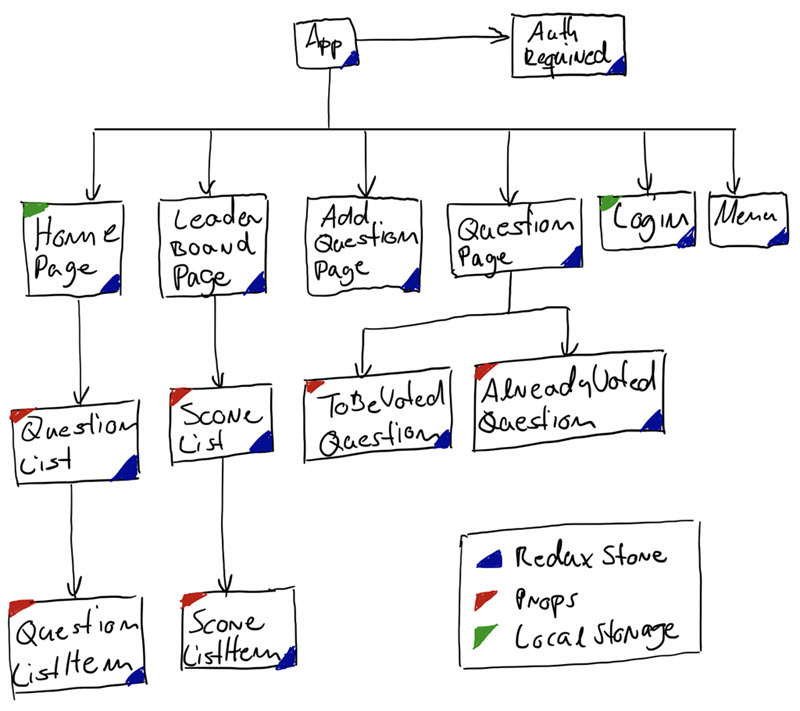

# Would You Rather Project 

## Getting Started

To get the project started right away:

- Install package manage ```yarn``` if not already installed: ```npm install --global yarn```
- Install all project dependencies with `yarn install`
- Start the development server with `yarn start`

After ```yarn start``` the app will be compiled and opened in the browser (```http://localhost:3000/login```)

The project overview and instructions of the app and some screenshots have been copied from Udacity ([Overview](https://classroom.udacity.com/nanodegrees/nd019/parts/87b7741f-aace-4bc9-88f4-7feccbb6eacb/modules/aaf1a102-6754-48aa-a0a5-a7736bf16e0a/lessons/996c5cf6-3220-42f5-a780-3ab2752f2fb2/concepts/d626ac42-da22-4cc3-affe-b393d240d08c) / [Instructions](https://classroom.udacity.com/nanodegrees/nd019/parts/87b7741f-aace-4bc9-88f4-7feccbb6eacb/modules/aaf1a102-6754-48aa-a0a5-a7736bf16e0a/lessons/996c5cf6-3220-42f5-a780-3ab2752f2fb2/concepts/d0b35860-eabe-414e-80bb-bfc0edeab6fe)) and are linked [here](./doc/Instructions.md): 

The ```README.md``` from the starter code has been linked [here](./doc/../README_starter.md).

## General Architectural Considerations

### Class vs Functional Components
The course was mainly built upon the concept of *class components* which is more and more replaced by *functional componets* with *hooks*.

This became apparent during the last project in the course (```chirper-app```) where the current version ```V6``` of ```React Router``` wasn't compatible with some concept anymore.

As I wasn't willing to downgrade to a lower version of ```React Router``` I working around the issues by providing an self-made version of ```withRouter```. In the end I got the Chirper App up and running with ```class``` components and ```mapStateToProperties``` but it felt a bit arkward.

After skimming through the mentors answers to other users who had very similar questions I followed the advise of a mentor and implmented the "Would You Rather"-project completly with *functional components*. This lead to a solution that in my opinion matches better to a modern React development style.

### Store Architecture
According to the project instructions most of the state has to be implemented with ```Redux-Store```. The developed solution complies to this guideline for all data that is used in more than one component:
- Currently logged in **authedUser** (null for not logged in)
- All **questions** with their current state (answers, ...)
- All **users** with their current state (votes, ...)

Exceptions where made in several components for the following use cases
- **Local Store**: Buffer a specific value from the UI for later processing by a event handler
- **Props**:
  - Components which visualize a specific item get the (also calulated) attributes passed as ```props``` from the higher component, e.g. list components.
  - A list with (also calculated) specific attributes will be passed as ```props``` (```QuestionList```, ```ScoreList```)
- **LocalStorage**: Only for specific use case that need to survive a page switch or a full reload
  - Currently selected tab on the home page
  - Currently logged in user (in a productive version this would have been implemented with at least a timestamp to log of an user after a certain time of inactivity)

**Component Overview**



## Project Setup

The project has been created from scratch with ```yarn``` as the package manager from the start:

```bash
# Create project from scratch with yarn from the beginning
yarn create react-app udacity-would-you-rather
```
### Addtional Tools/Libraries
Package Manager
- ```yarn```

Routing
- ```react-router-dom```

Redux
- ```redux```
- ```react-redux```
- ```react-redux-loading```
- ```redux-thunk```

Styling
- ```react-icons```
- ```react-bootstrap```
- ```bootstrap@5.1.3```

Code 
- ```eslint```

### Project Structure
The general structure is like the usual one of a Reat-project. Below the ```src``` folder is the individual part, the most important folders and files (are as follows):

```
src
├── index.js                        # Root page, contains App & Store
├── components
|   |── App.js                      # Main Coponent
|   |── App.css                     # Styles (apply to all components)
|   |── Home
|   |   |── HomePage.js             # Home Page (answered/unanswered)
|   |   |── QuestionList.js         # List of questions
|   |   └── QuestionListItem.js     # Question visualization
|   |── LeaderBoard
|   |   |── LeaderBoardPage.js      # Leader Board Page
|   |   |── ScoreList.js            # List of scores
|   |   └── ScoreListItem.js        # Score visualization
|   |── Login
|   |   |── LoginPage.js            # Login Page
|   |   └── AuthRequireddPage.js    # Wrapper for authentication check
|   |── Menu
|   |   └── Menu.js                 # Menu Page
|   |── NotFound
|   |   └── NotFound.js             # Will be shown for unknown route
|   └── Questions
|       |── AddQuestionPage.js      # Page for adding new questions
|       |── QuestionPage.js         # Question has been answered?
|       |── AlreadyVotedQuestion.js # YES: Show users vote + statistics
|       └── ToBeVotedQuestion.js    # NO : Pull users vote
├── middleware
|   |── index.js                    # Bundles middlware (logger, thunk)
|   └── logger.js                   # Custom middleware for logging
├── actions
|   |── questions.js                # Receive/Add/Answer Questions
|   |── users.js                    # Receive/Update users
|   |── authedUser.js               # Set authed user
|   └── shared.js                   # Thunk to load initial data
|── reducers
|   |── questions.js                # Receive/Add/Answer Questions
|   |── users.js                    # Receive/Update users
|   |── authedUser.js               # Set authed user
|   └── index.js                    # Compine reducersoad initial data
└── utils
    |── _DATA.js                    # Data as provided from starter code
    └── apis.js                     # Wrapper to provide an API
```

## Useful Links 

- [react-boostrap and react-router causing full page reload](https://stackoverflow.com/questions/59530374/react-boostrap-and-react-router-causing-full-page-reload)
- [Converting Object to an Array](https://www.samanthaming.com/tidbits/76-converting-object-to-array/)
- [Two arrays inner join in JavaScript](https://stackoverflow.com/questions/66985164/two-arrays-inner-join-in-javascript)
- [Right-align NavBar Item](https://stackoverflow.com/questions/42311292/react-bootstrap-navbar-how-to-right-align-a-navbar-item)
- [Bootstrap 5 Flex Alignment](https://getbootstrap.com/docs/5.0/utilities/flex/#align-items)
- [Local Images in React](https://stackoverflow.com/questions/44154939/load-local-images-in-react-js)
- [Bootstrap Color Customization](https://getbootstrap.com/docs/5.0/customize/color/)
- [How to change Tabs Layout and Tab style in react bootstrap](https://stackoverflow.com/questions/62921542/how-to-change-tabs-layout-and-tab-style-in-react-bootstrap)
- [Bootstrap Button Border Style](https://stackoverflow.com/questions/70325840/bootstrap-5-button-border-color-via-css)
- [React Router V6 Authentication](https://reactrouter.com/docs/en/v6/examples/auth)
- [How To Share State Across React Components with Context](https://www.digitalocean.com/community/tutorials/how-to-share-state-across-react-components-with-context)
- [Are many useStates better than useState(object)?](https://thoughtspile.github.io/2021/10/11/usestate-object-vs-multiple/)
- [Use Local Storage](https://www.freecodecamp.org/news/how-to-use-localstorage-with-react-hooks-to-set-and-get-items/)
