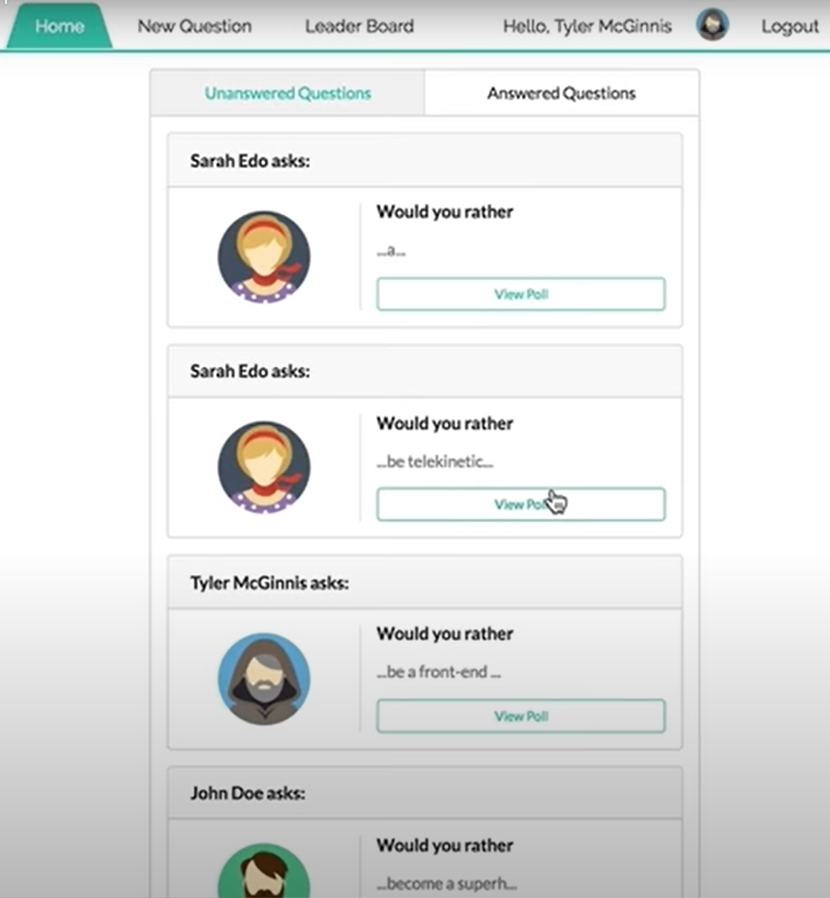
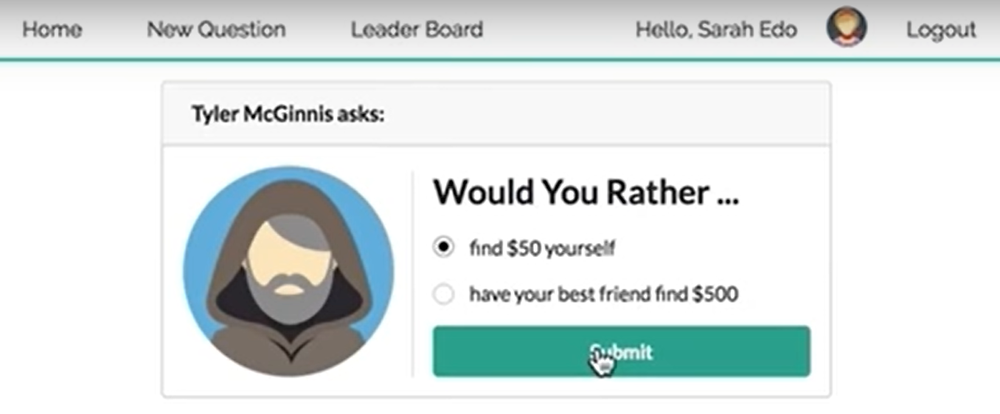
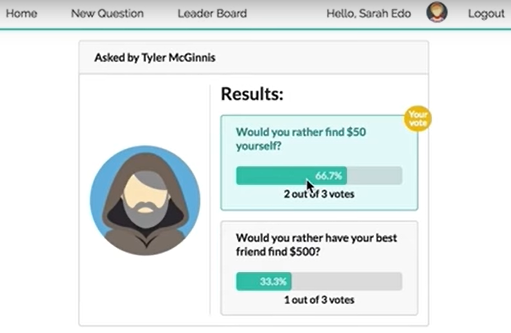

# Project Instrctions

## App Functionality

The person using your application should have a way of impersonating/logging in as an existing user. (This could be as simple as having a login box that appears at the root of the application that lets the user select a name from the list of existing users. Alternatively, you could create your own account creation process to allow a user to sign up for an account.) Your application should work correctly regardless of which user is selected. Once the user logs in, the home page should be shown.

We always want to make sure we know who the logged in user is, so information about the logged in user should appear on the page. If someone tries to navigate anywhere by entering the address in the address bar, the user is asked to sign in and then the requested page is shown. The application allows the user to log out and log back in.

Once the user logs in, the user should be able to toggle between his/her answered and unanswered polls on the home page, which is located at the root. The polls in both categories are arranged from the most recently created (top) to the least recently created (bottom). The unanswered questions should be shown by default, and the name of the logged in user should be visible on the page.

What would be the point of seeing answered and unanswered polling questions if we couldn’t actually vote or see the results? Each polling question should link to the details of that poll. The details of each poll should be available at ```questions/:question_id.```

When a poll is clicked on the home page, the following is shown:

1. Text “Would You Rather”;
2. Avatar of the user who posted the polling question; and
3. Two options.

For answered polls, each of the two options contains the following:

1. Text of the option;
2. Number of people who voted for that option; and
3. Percentage of people who voted for that option.

The option selected by the logged-in user should be clearly marked.

Since we want to make sure our application creates a good user experience, the application should show a 404 page if the user is trying to access a poll that does not exist. (Please keep in mind that newly created polls will not be accessible at their url because of the way the backend is set up in this application.) It should also display a navigation bar so that the user can easily navigate anywhere in the application.

So what happens when someone votes in a poll? Upon voting in a poll, all of the information of an answered poll should be displayed. The user’s response should be recorded and clearly visible on the poll details page. Users can only vote once per poll; they shouldn’t be allowed to change their answer after they’ve voted -- no cheating allowed! When the user comes back to the home page, the polling question should appear in the “Answered” column.

It would be no fun to vote in polls if we couldn’t post our own questions! The form for posting new polling questions should be available at the ```/add``` route. The application should show the text “Would You Rather” and have a form for creating two options. Upon submitting the form, a new poll should be created, the user should be taken to the home page, and the new polling question should appear in the correct category on the home page.

But how can we know how many questions each user has asked and answered? Let’s get some healthy competition going here! The application should have a leaderboard that’s available at the ```/leaderboard``` route. Each entry on the leaderboard should contain the following:

1. User’s name;
2. User’s picture;
3. Number of questions the user asked; and
4. Number of questions the user answered

Users should be ordered in descending order based on the sum of the number of questions they’ve asked and the number of questions they’ve answered. The more questions you ask and answer, the higher up you move.

The user should be able to navigate to the leaderboard, to a specific question, and to the form that allows the user to create a new poll both from within the app and by typing in the address into the address bar. To make sure we’re showing the data that is relevant to the user, the application should require the user to be signed in order to access those pages.

## App Architecture

By walking through the Planning Stage and the Coding Stage of the Chirper Project, we’ve given you a useful template for building Redux applications. We recommend using this template for building your “Would You Rather?” Project. Remember that planning your project and its architecture before starting to code will save you a lot of debugging time later on!

For this application, most of the application’s state should be managed by Redux. You’ll find that there are situations where it makes sense to store state outside of the Redux store. Check out what Dan Abramov, the creator of Redux, thinks about [choosing between Redux's store and React's state](https://github.com/reduxjs/redux/issues/1287).

Your application’s store should be the source of truth, and components should read the necessary state from the store instead of having their own versions of the same state. There should be no direct API calls in components’ lifecycle methods, and updates should be triggered by dispatching action creators.

Your application’s code should be structured and organized in a logical way, and your components should be modular and reusable.


## Layout Propsal

### Login


### Home



### Unanswered Question



### Answered Question



### New Question


### Lead Board


